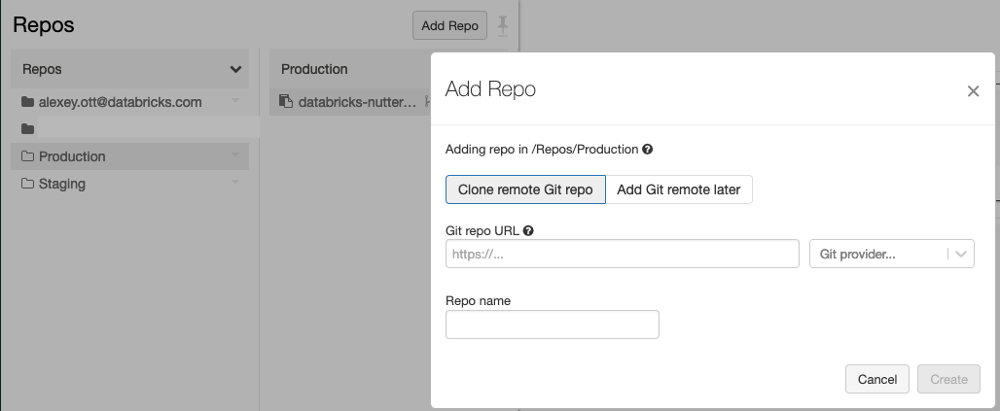
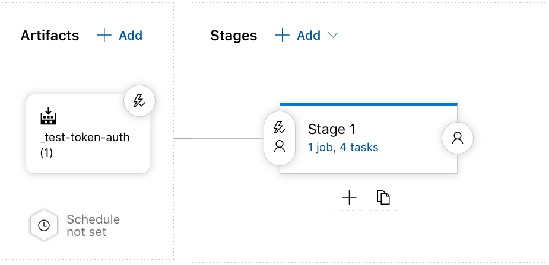
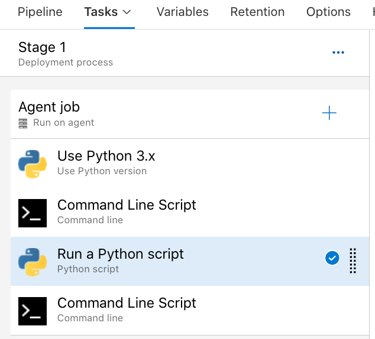
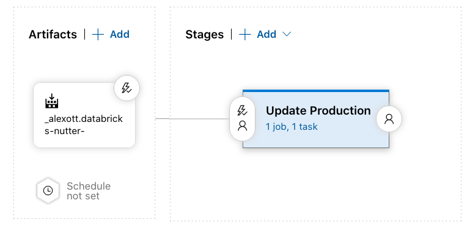

This repository contains notebooks & instructions for setting up the demo of development workflow & CI/CD (on Azure DevOps) using the Databricks notebooks and [Repos feature](https://docs.databricks.com/repos.html).  Testing of notebooks is done using the [Nutter library](https://github.com/microsoft/nutter) developed by Microsoft.  The "main" code is in the notebooks `Code1.py` and `Code2.py`, and the testing code is in the `test_code1_code2.py`.

This demo shows how you can use Repos to work on your own copy of notebooks, test them after commit in the "staging" environment, and promote to "production" on successful testing of `releases` branch.

# The workflow

The development workflow is organized as on following image:


1. Developer works on the code in the separate environment (personal space on Databricks, etc.).  When code changes are done, they are committed into some branch
1. CI/CD implementation (Azure DevOps here) picks up the changes, and tests them in a staging environment (executes the "build pipeline").  This consists of several steps (see [azure-pipelines.yml](azure-pipelines.yml) for technical details):
   * Update repository checkout in the "Staging" folder
   * Execute tests with updated code
   * Publish tests results
1. In current setup, there are different jobs for the "normal" branches, and for "release" branch (`releases` in this setup), this would allow to run different sets of tests when we're preparing the release
1. If commit is done to the "release branch, and there are no test failures, then the "release pipeline" is triggered, and it updates the production environment by updating the repository checkout in the "Production" folder.


# Setup on Databricks side

Your Databricks workspace needs to have Repos functionality enabled.  If it's enabled, you should see the "Repos" icon in the navigation panel:

* Fork repository into your environment - Github, or Azure DevOps (follow Databricks documentation on setting
* In the Repos, click "Create Repo" and link it to the Git repository that you've forked - this will be your personal copy of the code that will be used for work:



* Create the staging & production checkouts
  * In the Repos, in the top-level part, click on the "ᐯ" near the "Repos" header, select "Create" and select "Folder" (see image).  Give it the name "Staging":


  * Click on the  "ᐯ" near the "Staging" folder, and click "Create" and select "Repo":


  * Link it to the Git repository, similarly how you did it for your personal checkout
  * Create the "Production" folder with repository inside, repeating two previous steps
* Create a new cluster that will be used for execution of the tests, you will need to pass the [cluster ID](https://docs.databricks.com/workspace/workspace-details.html#cluster-url-and-id) to the Nutter to execute the tests


# Setup Azure DevOps pipelines

The Azure DevOps setup consists of the several steps, described in the next sections.  It's assumed that project in Azure DevOps already exists.

## Instructions for repository inside Azure DevOps

The instructions for Git repositories hosted on Azure DevOps are slightly different than for other Git providers.  This happens because we need to authenticate to Databricks workspace using the [Azure Active Directory (AAD) token](https://docs.microsoft.com/en-us/azure/databricks/dev-tools/api/latest/aad/), not the personal access token.   This token then will be used to authenticate to Azure DevOps to perform the checkout.  Usually for such tasks we're using [Azure service principals](https://docs.microsoft.com/en-us/azure/active-directory/develop/app-objects-and-service-principals) - they also need to be [added into Databricks workspace](https://docs.microsoft.com/en-us/azure/databricks/dev-tools/api/latest/scim/scim-sp) to be able to perform operations.  AAD token could be obtained by just using the [Azure REST API](https://docs.microsoft.com/en-us/azure/databricks/dev-tools/api/latest/aad/service-prin-aad-token#--get-an-azure-active-directory-access-token), but in this example I'll use the [adal Python library](https://pypi.org/project/adal/) for that.

### Create variables group to keep common configuration

Because we have several pipelines, the it's makes sense to define [variable group](https://docs.microsoft.com/en-us/azure/devops/pipelines/library/variable-groups) to store the data that are necessary for execution of tests & deployment of the code.  We need following configuration properties for execution of our pipelines:

* `databricks_host` - the [URL of your workspace](https://docs.databricks.com/workspace/workspace-details.html#workspace-instance-names-urls-and-ids) where tests will be executed (host name with `https://`, without `?o=`, and without trailing slash character.  For example: `https://adb-1568830229861029.9.azuredatabricks.net`).
* `cluster_id` - the ID of the cluster where tests will be executed.
* `client_id` - the Client ID of the service principal
* `client_secret` - service principal's secret
* `tenant_id` - tenant ID where service principal was creaed.

The name of the variable group is used in the [azure-pipelines-devops.yml](azure-pipelines-devops.yml). By default its name is "Nutter Testing on DevOps".  Change the [azure-pipelines-devops.yml](azure-pipelines-devios.yml) if you use another name for the variable group.

### Create the build pipeline

* In the Azure DevOps, in the Pipelines section, select Pipelines, and click "New pipeline"
* Select Azure DevOps repository
* In the "Configure" step select the "Existing Azure Pipelines YAML file" and specify the name of the existing file: [azure-pipelines-devops.yml](azure-pipelines-devops.yml)
* Save pipeline


### Create the release pipeline

* In the Azure DevOps, in the Pipelines section, select Releases, and click "New release pipeline"
* Select "Empty Job" in the dialog
* In the Stage dialog enter some meaningful name for it
* In the "Variables" tab, link the variable group that was created previously
* Configure job & tasks:
  * Configure agent - in the "Agent Specification" select "ubuntu-18.04"
  * Click on "+" and find the "Use Python 3.x" task
  * Click on "+" and find the "Command line" task.
    * Enter `pip install adal` in the "Script" field
  * Click on "+" and find the "Run a Python script" task
    * Select "inline" as "Script source" and enter following code:

      ```python
      from adal import AuthenticationContext
      import sys
      import requests
      resource_id = "2ff814a6-3304-4ab8-85cb-cd0e6f879c1d"
      client_id = sys.argv[1]
      client_secret = sys.argv[2]
      tenant_id = sys.argv[3]
      authority_url = f"https://login.microsoftonline.com/{tenant_id}"
      auth_context = AuthenticationContext(authority_url)
      token_response = auth_context.acquire_token_with_client_credentials(resource_id, client_id, client_secret)
      access_token = token_response['accessToken']
      print('##vso[task.setvariable variable=AccessToken;]%s' % (access_token))
      ```

    * In the "Arguments" field enter `$(client_id) $(client_secret) $(tenant_id)`
  * Click on "+" and find the "Command line" task
    * Enter following code that will connect to the production environment & update the checkout of the repository (via [Repos REST API](https://docs.databricks.com/dev-tools/api/latest/repos.html)):

```sh
curl -s -n -X GET -o /tmp/prod-repo-info.json "$DATABRICKS_HOST/api/2.0/workspace/get-status" -H "Authorization: Bearer $DATABRICKS_TOKEN" -d '{"path":"/Repos/Production/databricks-nutter-projects-demo"}'
cat /tmp/prod-repo-info.json
export RELEASE_REPOS_ID=$(cat /tmp/prod-repo-info.json|grep '"object_type":"REPO"'|sed -e 's|^.*"object_id":\([0-9]*\).*$|\1|')
curl -s -n -X PATCH -o "/tmp/releases-out.json" "$DATABRICKS_HOST/api/2.0/repos/$RELEASE_REPOS_ID" \
  -H "Authorization: Bearer $DATABRICKS_TOKEN" -d "{\"branch\": \"releases\"}"
cat "/tmp/releases-out.json"
grep -v error_code "/tmp/releases-out.json"
```

    * Below the code, add environment variable `DATABRICKS_TOKEN` with value `$(AccessToken)` - this will pull it from the variable group into the script's execution context
  * Save task & job
* We also need to configure an artifact:
  * Click on "Add artifact", select project, and source (the name of the build pipeline). Also, for "Default version" select "Latest from specific branch with tags" and select the "releases" branch.  Click on "Add" to add artifact into pipeline
  * Click on the "⚡" icon to configure the continuous deployment (by default, release is triggered manually).  Add branch filter and also select the `releases` branch
* Your release pipeline should look as following:



with tasks defined as this:



* Save the pipeline

After all of this done, the release pipeline will be automatically executed on every successful build in the `releases` branch.


## Instructions for other Git providers (GitHub, etc.)

When we use other Git providers we need to create a [personal access token (PAT)](https://docs.databricks.com/administration-guide/access-control/tokens.html) that will be used for execution of the tests & updating the repository.  This token will be used to authenticate to Databricks workspace, and then it will fetch configured token to authenticate to Git provider.

### Create variables group to keep common configuration

Because we have several pipelines, the it's makes sense to define [variable group](https://docs.microsoft.com/en-us/azure/devops/pipelines/library/variable-groups) to store the data that are necessary for execution of tests & deployment of the code.  We need following configuration properties for execution of our pipelines:

* `databricks_host` - the [URL of your workspace](https://docs.databricks.com/workspace/workspace-details.html#workspace-instance-names-urls-and-ids) where tests will be executed (host name with `https://`, without `?o=`, and without trailing slash character.  For example: `https://adb-1568830229861029.9.azuredatabricks.net`).
* `databricks_token` - personal access token for executing commands against the workspace.  Mark this variable as private!  Note that if you're using Azure DevOps to host repository, then you need to use AAD token instead (see instructions below).
* `cluster_id` - the ID of the cluster where tests will be executed.

The name of the variable group is used in the [azure-pipelines.yml](azure-pipelines.yml). By default its name is "Nutter Testing".  Change the [azure-pipelines.yml](azure-pipelines.yml) if you use another name for variable group.

### Create the build pipeline

Azure DevOps can work with GitHub repositories as well - see [documentation](https://docs.microsoft.com/en-us/azure/devops/pipelines/repos/github) for more details on how to link DevOps with GitHub.

* In the Azure DevOps, in the Pipelines section, select Pipelines, and click "New pipeline"
* Select GitHub and repository
* In the "Configure" step select the "Existing Azure Pipelines YAML file" and specify the name of the existing file: [azure-pipelines.yml](azure-pipelines.yml)
* Save pipeline


### Create the release pipeline

* In the Azure DevOps, in the Pipelines section, select Releases, and click "New release pipeline"
* Select "Empty Job" in the dialog
* In the Stage dialog enter some meaningful name for it
* In the "Variables" tab, link the variable group that was created previously
* Configure job & task:
  * Configure agent - in the "Agent Specification" select "ubuntu-18.04"
  * Click on "+" and find the "Command line" task
  * Enter following code that will connect to the production environment & update the checkout of the repository (via [Repos REST API](https://docs.databricks.com/dev-tools/api/latest/repos.html)):

```sh
curl -s -n -X GET -o /tmp/prod-repo-info.json "$DATABRICKS_HOST/api/2.0/workspace/get-status" -H "Authorization: Bearer $DATABRICKS_TOKEN" -d '{"path":"/Repos/Production/databricks-nutter-projects-demo"}'
cat /tmp/prod-repo-info.json
export RELEASE_REPOS_ID=$(cat /tmp/prod-repo-info.json|grep '"object_type":"REPO"'|sed -e 's|^.*"object_id":\([0-9]*\).*$|\1|')
curl -s -n -X PATCH -o "/tmp/releases-out.json" "$DATABRICKS_HOST/api/2.0/repos/$RELEASE_REPOS_ID" \
  -H "Authorization: Bearer $DATABRICKS_TOKEN" -d "{\"branch\": \"releases\"}"
cat "/tmp/releases-out.json"
grep -v error_code "/tmp/releases-out.json"
```

  * Below the code, add environment variable `DATABRICKS_TOKEN` with value `$(DATABRICKS_TOKEN)` - this will pull it from the variable group into the script's execution context
  * Save task & job
* We also need to configure an artifact:
  * Click on "Add artifact", select project, and source (the name of the build pipeline). Also, for "Default version" select "Latest from specific branch with tags" and select the "releases" branch.  Click on "Add" to add artifact into pipeline
  * Click on the "⚡" icon to configure the continuous deployment (by default, release is triggered manually).  Add branch filter and also select the `releases` branch
* Your release pipeline should look as following:



* Save the pipeline

After all of this done, the release pipeline will be automatically executed on every successful build in the `releases` branch.
